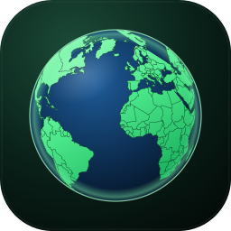

# 🌍 Country Info Sync



A professional, offline-first Flutter application for exploring global country information.

## 📌 Project Overview

Country Info Sync is a Flutter-based application that lets users explore, search,
save, and compare countries around the world. Data is fetched from a public API,
cached locally with **Hive**, and enriched with Wikipedia summaries and a curated
list of UNESCO heritage sites — so the app stays useful even without a connection.

## ✨ Features

Here is what the app can do, in plain terms:

- 🌍 **Country Explorer** — A scrollable list of every country with its flag,
  name, and capital city.
- 🔍 **Smart Search** — Search by country name **or** capital, case-insensitive,
  with exact matches sorted first (e.g. typing "ira" puts *Iran* and *Iraq*
  above *Nigeria*).
- ❤️ **Favorites** — Tap the heart on any country to save it. Favorites are
  stored persistently and survive a full app restart.
- ⭐ **Favorites-only Filter** — A single toggle in the app bar narrows the list
  down to only your favorited countries (composes with the search box).
- ⚖️ **Compare Countries** — Long-press up to **2** countries to select them,
  then tap the floating **Compare** button to see their stats side by side
  (capital, population, area, continent, subregion, calling code, languages,
  currencies, timezones).
- 📄 **Country Details** — A rich detail screen with the flag (animated with a
  Hero transition), native name, and clearly grouped sections:
  - **General Information** — capital, population, subregion, area.
  - **Communication** — calling code, languages, timezones, currencies.
  - **Detailed Records** — full lists of languages, currencies, and border countries.
- 🏛️ **UNESCO Heritage Sites** — Countries with curated data show a heritage
  section with each site's name and description. Uses an offline-bundled JSON
  file, so no network is required.
- 📖 **Wikipedia Insight** — An "About <country>" card with a short summary
  pulled from the Wikipedia REST API, including a link to the full article.
  Summaries are cached for offline reuse.
- 🌗 **Dark & Light Theme** — Toggle between themes from the app bar. The choice
  is remembered across restarts.
- 💾 **Offline-First** — Country data is cached in Hive; if the network is
  unavailable a bundled `countries.json` is used as a final fallback.
- 📱 **Polished, Adaptive UI** — Responsive spacing that scales across screen
  sizes, shimmer loading placeholders, graceful empty/error states, and
  auto-shrinking text for very long country names.
- 🌐 **Localization-ready** — Latin text uses **Inter**; Persian/Arabic glyphs
  automatically fall back to **Vazirmatn**, so mixed strings render correctly.

## 🛠️ Tech Stack

- **Flutter & Dart** (3.13.2+)
- **Networking**: [`http`](https://pub.dev/packages/http) — REST calls to
  `countries.dev` (country data) and the Wikipedia REST API (summaries)
- **Local Persistence**: [`hive`](https://pub.dev/packages/hive) &
  [`hive_flutter`](https://pub.dev/packages/hive_flutter) — caches countries,
  favorites, theme choice, and Wikipedia summaries
- **Image Caching**: [`cached_network_image`](https://pub.dev/packages/cached_network_image)
  for flags
- **Links**: [`url_launcher`](https://pub.dev/packages/url_launcher) to open the
  Wikipedia source
- **Typography**: [`google_fonts`](https://pub.dev/packages/google_fonts)
  (Inter for Latin, Vazirmatn for Persian)
- **Localization**: `flutter_localizations`
- **Architecture**: No external state management — UI state is handled directly
  with `StatefulWidget` + `setState`, and a plain `ValueNotifier<ThemeMode>` for
  the theme.

## 🚀 How to Run

### Prerequisites

- Flutter SDK (3.13.2+)
- Dart 3.x
- Platform-specific requirements:
  - **Android**: Android SDK 21+
  - **iOS**: Xcode 14+
  - **macOS**: Xcode 14+
  - **Web**: Any modern browser
  - **Windows**: Windows 10+ (⚠️ Untested)
  - **Linux**: (⚠️ Untested)

### Installation

```bash
# Get dependencies
flutter pub get

# Run the app
flutter run
```

### Build for Platforms

```bash
# Android
flutter build apk

# iOS
flutter build ios

# macOS
flutter build macos

# Windows
flutter build windows

# Linux
flutter build linux

# Web
flutter build web
```

## 📂 Project Structure

```
lib/
├── main.dart                     # Entry point: Hive init, light/dark theme setup
├── models/
│   ├── country.dart              # Country model + hand-written Hive adapter
│   ├── country_insight.dart      # Wikipedia summary model
│   └── heritage_site.dart        # UNESCO heritage site model
├── services/
│   ├── country_service.dart      # API sync + Hive cache + asset fallback
│   ├── favorites_service.dart    # Read/write favorite country names
│   ├── heritage_service.dart     # Loads the bundled heritage JSON
│   └── wikipedia_service.dart    # Wikipedia summaries + caching
├── screens/
│   ├── home_screen.dart          # Country list, search, favorites & selection
│   ├── details_screen.dart       # Multi-section country details view
│   └── compare_screen.dart       # Side-by-side country comparison
├── theme/
│   ├── app_spacing.dart          # Responsive spacing/size tokens
│   └── app_typography.dart       # Inter + Vazirmatn typography
└── widgets/
    ├── country_card.dart         # Country list card
    ├── details_widgets.dart      # InfoTile, InsightCard, HeritageCard
    ├── shimmer_loading.dart      # Loading skeleton
    └── empty_state_view.dart     # Empty / error state placeholder
assets/
├── data/
│   ├── countries.json            # Offline fallback country dataset
│   └── heritage_sites.json       # Curated UNESCO heritage sites
├── images/                       # App logo (SVG + PNG variants)
└── icons/                        # Platform icons used in this README
```

## 📱 Supported Platforms

| Platform | Status | Notes |
|---|:---:|---|
|  | ✅ Tested | Working perfectly on all devices |
|  | ✅ Tested | Working on iPhone & iPad |
|  | ✅ Tested | Chrome, Firefox, Safari compatible |
|  | ✅ Tested | Working on Apple Silicon |
|  | ❌ Not tested | Build available |
|  | ❌ Not tested | Build available |

> Android, iOS, Web, and macOS tested. Windows & Linux builds available but untested.

## 📝 License

MIT License. See [LICENSE](LICENSE) for details.

**Copyright © 2026 moradzadeh67**

This project is open-source and free to use, modify, and distribute under the MIT License terms.
